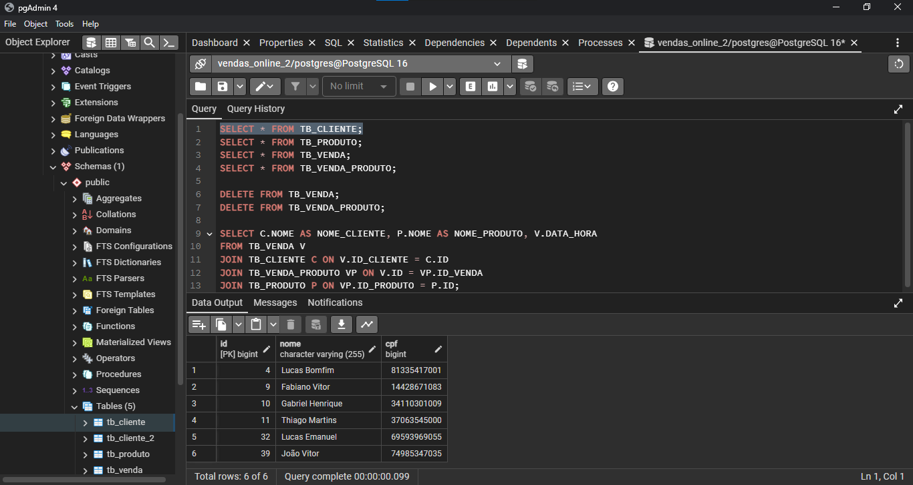
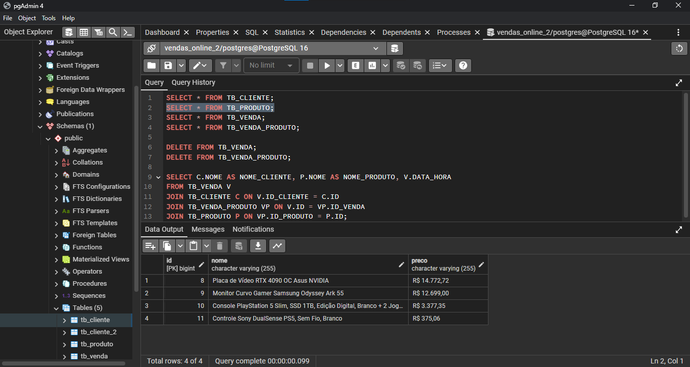
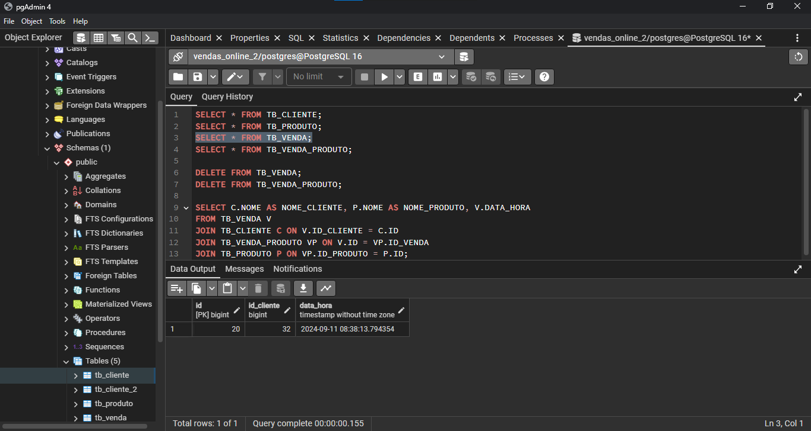
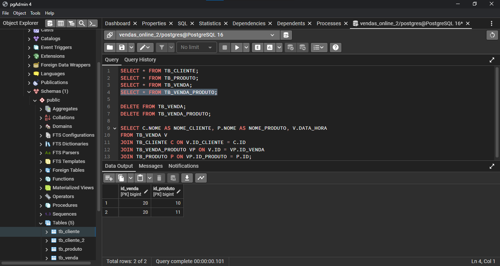
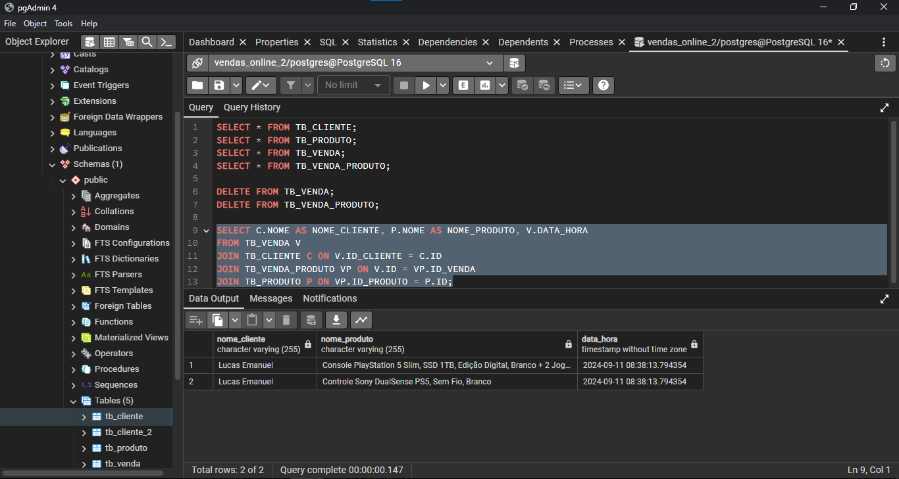

**COMANDOS SQL PARA ANALISAR A ESTRUTURA DO PROGRAMA**

> SELECT * FROM TB_CLIENTE;

> SELECT * FROM TB_PRODUTO;

> SELECT * FROM TB_VENDA;

> SELECT * FROM TB_VENDA_PRODUTO;

> SELECT * FROM TB_VENDA V, TB_VENDA_PRODUTO VP WHERE V.ID = VP.ID_VENDA;

*****
**SQL RECOMENDADO PELO AUTOR DO PROGRAMA**

	SELECT C.NOME AS NOME_CLIENTE, P.NOME AS NOME_PRODUTO, V.DATA_HORA
	FROM TB_VENDA V
	JOIN TB_CLIENTE C ON V.ID_CLIENTE = C.ID
	JOIN TB_VENDA_PRODUTO VP ON V.ID = VP.ID_VENDA
	JOIN TB_PRODUTO P ON VP.ID_PRODUTO = P.ID;
	

*****

*****

*****

*****

*****

